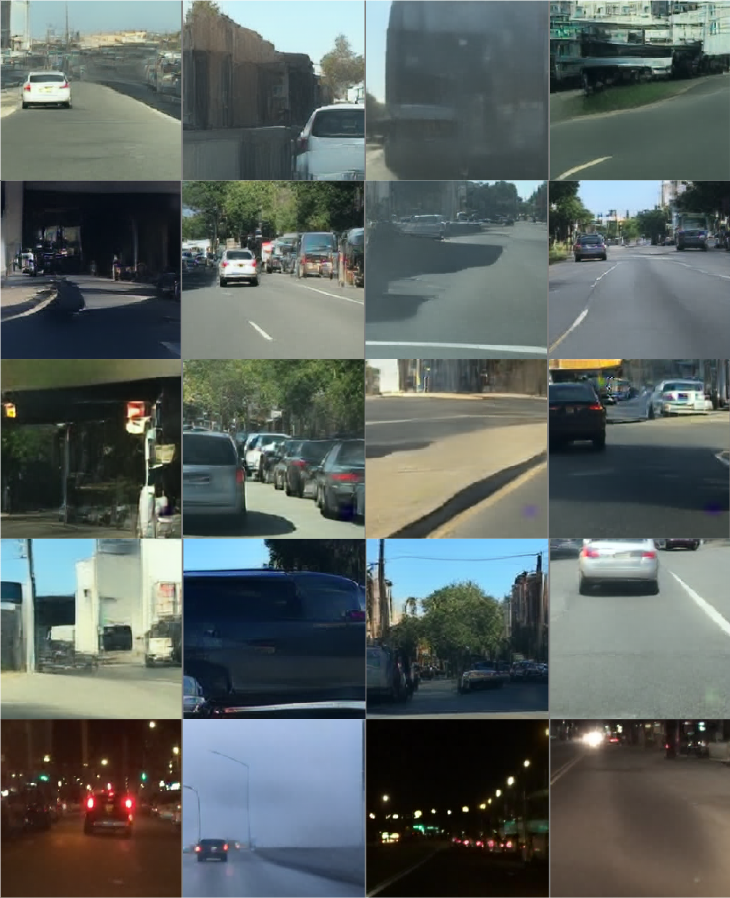
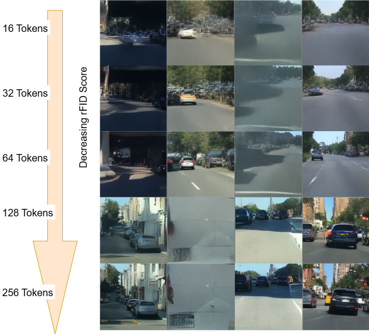
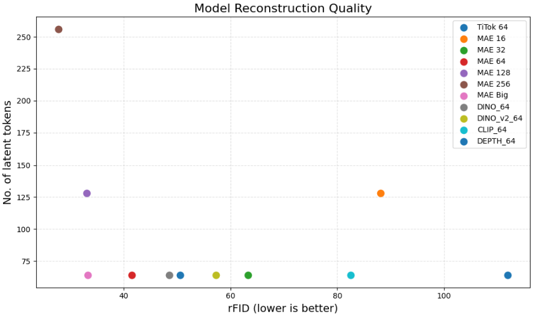

# 1D-Tokenization for Image Reconstruction and Generation

This repository hosts the code for reconstructing an image using varied number of learnable latent tokens (eg. 16, 32, 64, 128, 256) using uninitialized and initialized models (eg. MAE, CLIP, DINO, DINO-v2 and Depth-Anything v2). 

<table>
  <tr>
    <td align="center"></td>
    <td align="center"></td>
  </tr>
  <tr>
    <td align="center">Figure 1 : Image Reconstructions using 64 tokens and different models</td>
    <td align="center">Figuare 2 : Image Reconstructions using 1d-tokenizer - MAE model. Greater the number of latent tokens used for reconstruction, higher is the quality of reconstructed image (equivalent to Baseline)</td>
  </tr>
</table>

## Contributions 

We use the concept of 1D image tokenization for reconstructing the images using fixed number of learnable latent tokens. We train our model on BDD100K driving subdataset, with the image resolution of 256 x 256. Further, we utilize these output tokens from our 1d-tokenizer for image generation.

We further conduct various experiments with varied model initializations and number of latent tokens, compare the performances and claim 64 tokens to be a descent number for reconstruction of an image.

## Checkpoints

rFID Scores for the model trained using 64 tokens. Checkpoints for the same in 'checkpoints/Tokenizer_with_initialization'.

| Model                 |  rFID ↓   | 
|-----------------------|------------
| MAE                   |   41.44   | 
| CLIP                  |   42.90   |
| DINO                  |   38.42   | 
| DINO-v2               |   38.94   |
| Depth-Anything v2     |   39.60   | 
| Uninitialized Model   |   111.89  |
| Big Dataset - MAE     |   33.19   |

<table>
  <tr>
    <td align="center"></td>
  </tr>
  <tr>
    <td align="center">Figure 3 : Image Reconstruction using 1d-tokenizer. The plot shows the performance of varied models using different number of latent tokens</td>
  </tr>
</table>

## Requirements
A suitable python environment (For eg. `mamba`) named `tokenization` can be created and activated with:

```
mamba env create -f environment.yaml
conda activate tokenization
```

### Training 1d-tokenizer from scratch
```
python -m torch.distributed.launch --nproc_per_node=2 \
    main.py --base configs/vqgan_baseline.yaml -t True --n_gpus \
    2 --n_nodes 1 --name mae_16 --checkpoint_dir /work/dlclarge2/mutakeks-titok/mae_16
```
n_gpus: specifies number of gpus, default=1 \
n_nodes: specifies number of nodes, default=1

### Fine-tune from previous checkpoint
```
srun python -m torch.distributed.launch --nproc_per_node=2 \
    main.py --base /work/dlclarge2/mutakeks-titok/mae_16/config.yaml \
    -t True --n_gpus 2 --resumes /work/dlclarge2/mutakeks-storage_titok/mae_16/checkpoints/last.ckpt
```

### Compute FID score
```
python tools/compute_codebook_usage.py --config_path /work/dlclarge2/mutakeks-titok/mae_16/config.yaml --ckpt_path /work/dlclarge2/mutakeks-titok/mae_16/checkpoints/last.ckpt --compute_rFID_score
```
